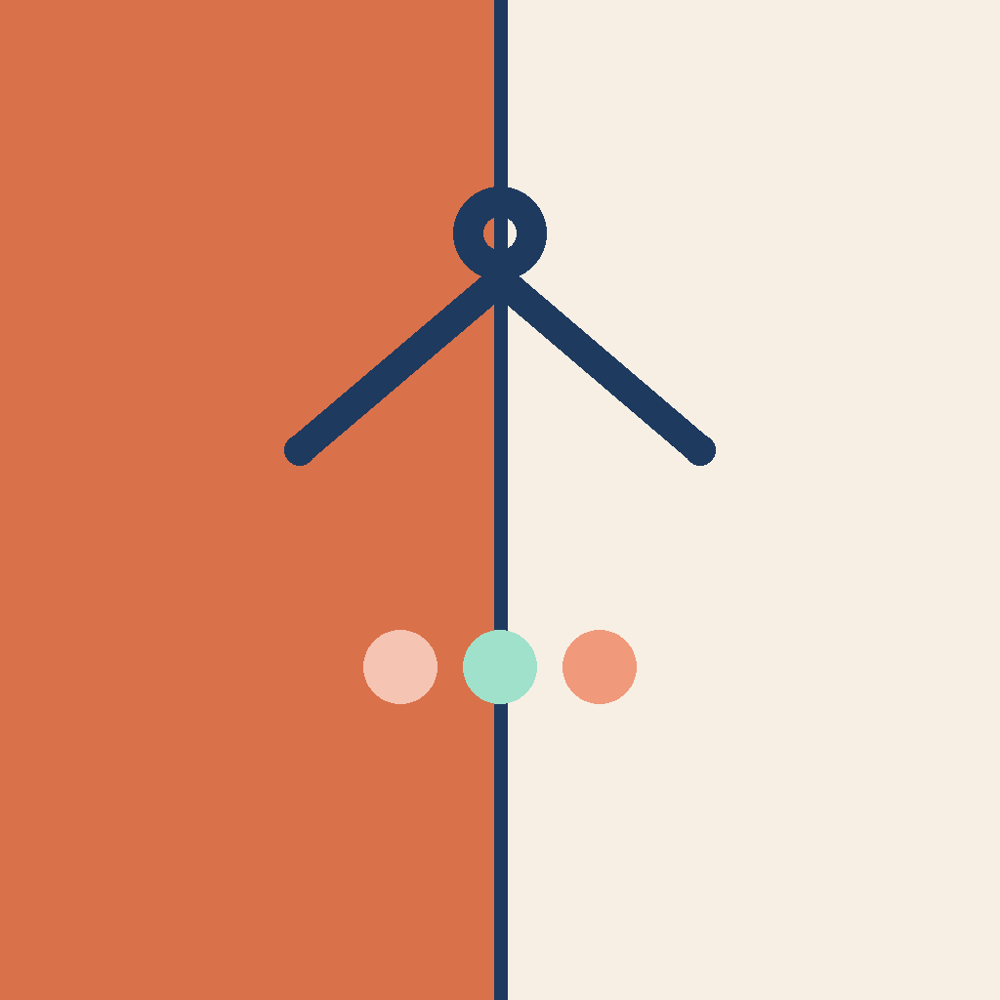

<div align="center">



# Wardro

**Your wardrobe, styled — on-device or by Claude.**

[](https://flutter.dev)
[](#)
[](CHANGELOG.md)
[](#configuration)
[](LICENSE)
[](https://ko-fi.com/crystaxit)

</div>

---

A personal digital wardrobe and outfit generator, built with Flutter. Snap a
photo of a clothing item, Wardro cuts it out and files it away, then helps
you put outfits together — either instantly on-device, or with an AI
stylist for occasions that matter.

Wardro is **local-first**: your wardrobe lives on-device in Hive, no
account or cloud sync involved. It's built for personal/self-hosted use
rather than app-store distribution — see [Configuration](#configuration)
for what that means for the AI Stylist's API key.

## ✨ Features

| | |
|---|---|
| 👕 **Digital wardrobe** | Photograph an item (camera or gallery); Wardro removes the background on-device, extracts its dominant color, and files it under Top / Bottom / Outerwear / Shoes |
| 🎨 **Quick Match** | Free, fully on-device outfit generator using Sanzo Wada's classic color-harmony data — no network call, no API key |
| 🤖 **AI Stylist** | Sends your wardrobe photos to Claude with a chosen occasion (Casual / Smart Casual / Formal / Evening) and gets back curated combinations with a rationale |
| ⭐ **Saved outfits** | Keep the combinations you like and revisit them later |
| ✏️ **Wardrobe editing** | Re-categorize or update items after the fact |
| 🌗 **Theming** | Light/dark mode |

## 🧱 Tech stack

- **Flutter** (Dart ^3.13.2), Material 3
- **State management:** Riverpod
- **Navigation:** go_router
- **Local-first storage:** Hive (no backend, no account system)
- **On-device background removal:** `image_background_remover`
- **AI Stylist:** direct HTTPS calls to `api.anthropic.com/v1/messages`
  (Claude), no server in between

## 📁 Project structure

```
lib/
  core/            # config, router, storage, theme, shared widgets
  features/
    wardrobe/      # add/edit/view clothing items, background removal
    outfits/       # Quick Match + AI Stylist generation, saved outfits
    settings/      # theme, about
```

Each feature follows a `domain / data / application / presentation`
split — plain models, repositories (Hive-backed), Riverpod providers, and
screens/widgets, respectively.

## 🖼️ App icon

Clay/cream split background with a navy hanger mark and three color-swatch
dots. The 1024×1024 master and the Play Store listing icon (512×512, flat)
are kept at `assets/branding/` for reference; the actual launcher assets
live in `android/app/src/main/res/mipmap-*` (legacy + adaptive icon layers)
and `ios/Runner/Assets.xcassets/AppIcon.appiconset` (full 18-size set,
including the App Store marketing icon).

## 🚀 Getting started

### Prerequisites

- Flutter SDK matching `environment.sdk` in `pubspec.yaml` (Dart ^3.13.2)
- A device/emulator (Android or iOS) — camera access is used for adding
  wardrobe items

### Setup

```bash
flutter pub get
```

### Configuration

The AI Stylist calls Anthropic directly from the app using your own API
key, supplied at build time (never committed):

1. Copy the template:
   ```bash
   cp dart_define.example.json dart_define.json
   ```
2. Edit `dart_define.json` and set your real key:
   ```json
   { "ANTHROPIC_API_KEY": "sk-ant-..." }
   ```
3. Always run/build with that file:
   ```bash
   flutter run --dart-define-from-file=dart_define.json
   ```

`dart_define.json` is gitignored. Without it, the AI Stylist shows a
friendly "not configured yet" error — **Quick Match works with no key at
all.**

Why a key baked into the client is fine here: Wardro isn't distributed to
other people's devices, so there's no untrusted audience to hide it from.
If that ever changes (App Store/Play Store, or wide adoption), this needs
revisiting — see the code comments in `lib/core/config/app_config.dart` and
`lib/features/outfits/services/outfit_generation_service.dart`.

### Running

```bash
flutter run --dart-define-from-file=dart_define.json
```

## 🧭 Status

See [CHANGELOG.md](CHANGELOG.md) for what's actually shipped, release by
release. The version shown in Settings is read from the installed build's
own metadata (via `package_info_plus`), which Flutter generates from
`pubspec.yaml`'s `version:` field — so it's always accurate, nothing to
sync by hand.

## 🗺️ Roadmap

- Weather/season-aware outfit suggestions
- Backup/export from Settings
- BYOK (per-user Anthropic key via Settings), if this ever moves beyond
  personal use

## ☕ Support

If Wardro is useful to you, consider buying me a coffee:

<a href="https://ko-fi.com/crystaxit">
  
</a>

## 📄 License

MIT — see [LICENSE](LICENSE).
